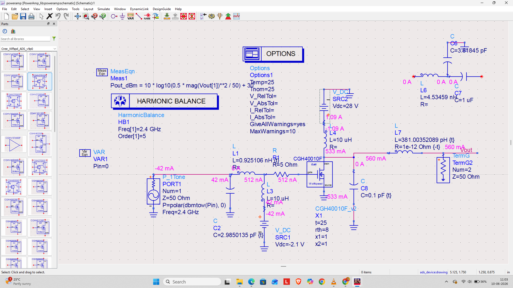

# Design and Analysis of a High-Efficiency GaN RF Power Amplifier

## Project Description
This project focuses on the design, optimization, and characterization of a high-efficiency RF Power Amplifier (PA) utilizing Gallium Nitride (GaN) High Electron Mobility Transistor (HEMT) technology. GaN devices are the industry standard for high-power, high-frequency applications—such as 5G base stations, satellite communications, and radar systems—due to their wide bandgap, superior power density, and high breakdown voltage limits compared to conventional Silicon or GaAs alternatives.

The primary objective of this work is to achieve optimal output power ($P_{out}$), high Power-Added Efficiency (PAE), and stable power gain over the targeted RF operating band while ensuring absolute circuit stability across all driving conditions.


.png)

---

## Technical Specifications & Targets
* **Transistor Technology:** Wolfspeed CGH40010F GaN HEMT PDK
* **Center Frequency:** 2.4 GHz
* **Operating Class:** High-Efficiency Class AB
* **Nominal Drain Bias ($V_{ds}$):** 28 V
* **Quiescent Current ($I_{dq}$):** ~200 mA

---
## Repository Structure

```text
📦 GaN-Power-Amplifier
 ┣ 📂 design_files
 ┃ ┣ 📜 gan_pa_integrated_workspace.ads # Integrated schematic design workspace file
 ┃ ┗ 📜 cgh40010f_model.pdk            # Device foundry PDK integration file
 ┣ 📂 plots
 ┃ ┗ 📜 pin_vs_pout_curve.png          # Large-signal power sweep saturation plot
 ┗ 📜 README.md                        # Project documentation and analysis

```
## Engineering Design & Simulation Pipeline

The power amplifier design lifecycle was executed sequentially within a single, continuously evolved integrated design workspace in Keysight Advanced Design System (ADS):

### 1. Model Setup and DC Biasing (IV Curves)
* **Action:** Imported the Wolfspeed CGH40010F PDK into ADS and configured the core DC simulation schematic networks.
* **Methodology:** Swept the gate voltage ($V_{gs}$ from $-4\text{ V}$ to $0\text{ V}$) and drain voltage ($V_{ds}$ from $0\text{ V}$ to $40\text{ V}$) to trace the complete device operational output characteristics.
* **Analysis:** Located the pinch-off boundary at approximately $-3\text{ V}$. Established a stable Class AB quiescent bias point at $V_{ds} = 28\text{ V}$ with an $I_{dq}$ target of ~200 mA to secure the optimum compromise between linearity and structural efficiency.

### 2. Bias Networks & Stability Network Synthesis
* **Action:** Formulated decoupled bias distribution networks to feed DC power safely while ensuring absolute RF isolation and circuit stability across a wide operating frequency band.
* **Implementation:** Integrated quarter-wavelength ($\lambda/4$) microstrip transmission lines terminated with localized RF bypass capacitors to act as an RF Choke at 2.4 GHz. Simultaneously, a parallel RC network and series resistance were synthesized directly into the gate feeding path to damp out destabilizing low-frequency gain, successfully achieving unconditional small-signal stability constraints.

### 3. Load-Pull Simulation (Large-Signal Core)
* **Action:** Executed large-signal Load-Pull simulations directly on the active transistor network to optimize output power matching, bypassing small-signal $S_{22}$ limitations under non-linear compression.
* **Mechanism:** Configured an automated impedance tuner model at the CGH40010F drain port to mathematically map power and PAE contours directly onto the Smith Chart, extracting the optimum compromise coordinate ($Z_{L,opt}$).

### 4. Smith Chart Impedance Matching Network (IMN & OMN) Design
* **Action:** Leveraged the interactive Smith Chart Utility toolset within the workspace to calculate and layout physical microstrip matching lines.
* **Output Matching Network (OMN):** Transformed the conventional $50\ \Omega$ antenna system load termination directly to the complex $Z_{L,opt}$ found during the load-pull sweeps.
* **Input Matching Network (IMN):** Transformed the incoming $50\ \Omega$ generator path to the complex conjugate of the transistor's input impedance ($Z_{in}^*$) for maximum localized power delivery.

### 5. Harmonic Balance (HB) Verification
* **Action:** Formulated a large-signal Harmonic Balance simulation engine around the fully matched topology to execute input power sweeps up into hard compression ($+35\text{ dBm}$).
* **Analysis:** Evaluated fundamental power transfer, power gain flatness constraints, and compression point extraction ($P_{1dB}$) to define clear power handling and saturation boundaries.

## Contributors
* [Shashikant Kalal](https://github.com/Shashi-kalal)
* [Tejaswini K N](https://github.com/tejaswini1009)
